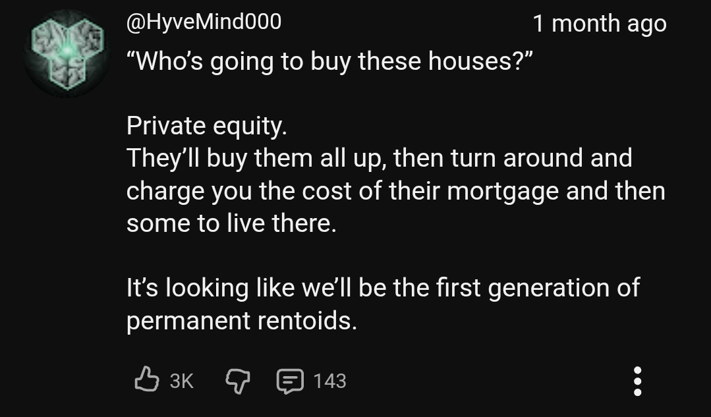
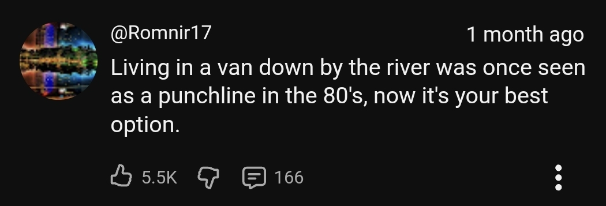
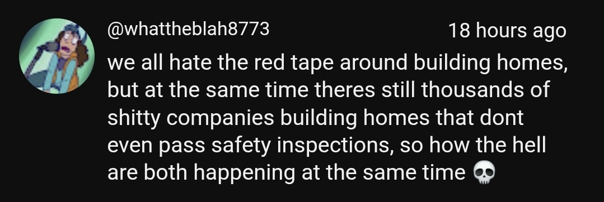
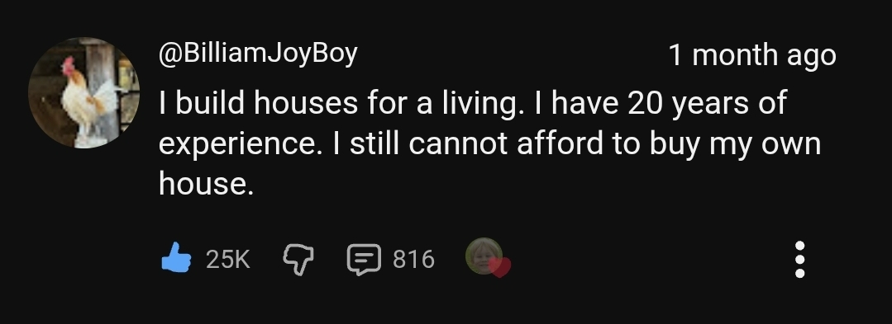

# Housing voices

What people online say about the housing situation. Collected by Sebastian as research for HESTIA Foundation (affordable homes).

## 9 Oct 2026 (YouTube comments)

**@HyveMind000** (3K likes, 143 replies): "Who's going to buy these houses?" Private equity. They'll buy them all up, then turn around and charge you the cost of their mortgage and then some to live there. It's looking like we'll be the first generation of permanent rentoids.

**@Romnir17** (5.5K likes, 166 replies): Living in a van down by the river was once seen as a punchline in the 80's, now it's your best option.

**@whattheblah8773**: we all hate the red tape around building homes, but at the same time theres still thousands of shitty companies building homes that dont even pass safety inspections, so how the hell are both happening at the same time

**@BilliamJoyBoy** (25K likes, 816 replies): I build houses for a living. I have 20 years of experience. I still cannot afford to buy my own house.

## Themes so far

- Investors and private equity buying homes, turning owners into renters
- Even builders cannot afford what they build
- Red tape slows building, yet quality is still poor
- Living in a van has become a real option
